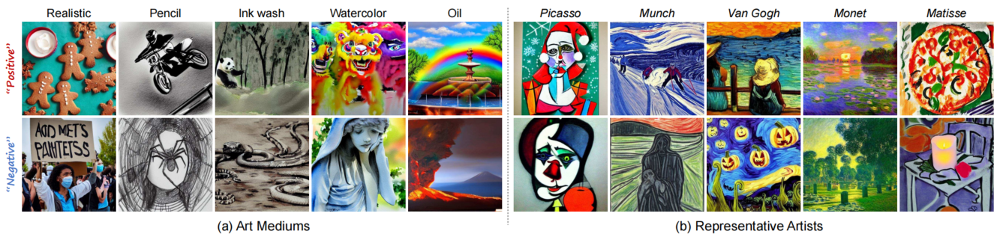

# EmoEdit: Evoking Emotions through Image Manipulation
> [Jingyuan Yang](https://jingyuanyy.github.io/)<sup>1</sup>, Jiawei Feng<sup>1</sup>, Weibin Luo<sup>1</sup>, [Dani Lischinski](https://www.cs.huji.ac.il/~danix/)<sup>2</sup>
, [Daniel Cohen-Or](https://danielcohenor.com/)<sup>3</sup>, [Hui Huang](https://vcc.tech/~huihuang)<sup>1</sup><sup>*</sup>  
> <sup>1</sup>Shenzhen University  <sup>2</sup>The Hebrew University of Jerusalem <sup>3</sup>Tel Aviv University<br>
> Affective Image Manipulation (AIM) seeks to modify user-provided images to evoke specific emotional responses. This task is inherently complex due to its twofold objective: significantly evoking the intended emotion, while preserving the original image composition. Existing AIM methods primarily adjust color and style, often failing to elicit precise and profound emotional shifts. Drawing on psychological insights, we introduce EmoEdit, which extends AIM by incorporating content modifications to enhance emotional impact. Specifically, we first construct EmoEditSet, a large-scale AIM dataset comprising 40,120 paired data through emotion attribution and data construction. To make existing generative models emotion-aware, we design the Emotion adapter and train it using EmoEditSet. We further propose an instruction loss to capture the semantic variations in data pairs. Our method is evaluated both qualitatively and quantitatively, demonstrating superior performance compared to existing state-of-the-art techniques. Additionally, we showcase the portability of our Emotion adapter to other diffusion-based models, enhancing their emotion knowledge with diverse semantics.

<a href="https://arxiv.org/abs/2405.12661"></a>

<p align="left">
  
<br>
Fig 1. Affective Image Manipulation with EmoEdit, which seeks to modify a user-provided image to evoke specific emotional responses
in viewers. Our method requires only emotion words as prompts, without necessitating detailed descriptions of the input or output image.
</p>

## Preliminary
You can download EmoEditSet, EmoEdit-inference-set, Q-Former checkpoint in [Dropbox](https://www.dropbox.com/scl/fo/xnw0bv4r228srka6zo9ek/AIBEnZIfU2AkbZyDo0kPrBs?rlkey=r7likmbhj6ud14xoyvjxbqmo0&st=dcdwu2i2&dl=0).

Other models like instructpix2pix, CLIP you can download from Huggingface.
### Quick test (without training)
All you need is Q-Former checkpoint, [InstructPix2Pix](https://huggingface.co/timbrooks/instruct-pix2pix) and [CLIP-ViT-L/14](https://huggingface.co/openai/clip-vit-large-patch14)

## QuickStart
Download EmoAdapter checkpoint and place it in the `checkpoint` folder.

Modify models' location in the `test.py` file .
```
git clone https://github.com/JingyuanYY/EmoEdit.git
cd EmoEdit
python test.py
```

## Construction of EmoEditSet
<p align="left">
  
<br>
Fig 2. Overview of EmoEditSet. (a) Emotion factor trees are built with various representative semantic summaries based on EmoSet.
(b) Through careful collection, generation and filtering, EmoEditSet is built with high-quality and semantic-diverse paired data.
</p>

You can download EmoEditSet (recommended, haven't uploaded) directly or construct by yourself.

### Emotion factor trees
```
cd emotion_attribution
```

Based on the [EmoSet](https://github.com/JingyuanYY/EmoSet) dataset, we first employed `emotion_attribution.py` to categorize images of different 
emotions into distinct groups. Then, using `GPT/code/Summary.py`, we extracted the common characteristics 
within each category, enabling us to construct Emotion Factor Trees with `emotion_factor_tree/generate.json.py`.

### Data_construction
First, we collected datasets from [MagicBrush](https://osu-nlp-group.github.io/MagicBrush/), 
[MA5K](https://github.com/jshi31/T2ONet), and [Unsplash](https://github.com/unsplash/datasets). 
Following the guidance in the paper, run the `division_data/compute_emo_score.py` file to calculate the emotion score for each image (note: update the dataset path accordingly).
Then, run the `division_data/division_data.py` file to classify the images based on their emotion scores and save them into separate folders.
All images were center-cropped to a uniform size of 512×512. 
Based on emotion factor trees, they were processed using the `data_construction/generate_image_LargeScale.py` script to generate new images, 
followed by filtering with the `data_construction/split_image_threshold_aes_txt.py` script, resulting in the final EmoEditSet. 
Notably, this process utilized 8 NVIDIA 4090 GPUs and took over a week, 
with the majority of the time spent on the filtering stage.

## EmoEdit

<p align="left">
  
<br>
Fig 3. Overview of EmoEdit. (a) EmoEdit trains the Emotion adapter with paired data from EmoEditSet, by optimizing instruction loss
and diffusion loss. (b) Given a user-provided image, EmoEdit can modify the image to evoke the desired emotion with clear semantics.
</p>

### Training

We need [MagicBrush](https://osu-nlp-group.github.io/MagicBrush/), 
[MA5K](https://github.com/jshi31/T2ONet), and [Unsplash](https://github.com/unsplash/datasets) to fulfill EmoEditSet as origin images. Since we have modified the structure of their dataset, directly using our EmoEditSet may result in incompatibility. You can adapt to different dataset structures by modifying how the `origin_image_path` variable is retrieved in the `scripts/dataset.py` file.

You need to update the model and dataset paths in the code to your own locations. I have marked all the potential spots requiring modification with `TODO` annotations to make it easier for you to identify and adjust them.

To train our EmoAdapter, follow these steps:

First, train your own Emotion adapter:
```
cd scripts
accelerate launch train.py
```

Secondly, edit image to emotional image:
```
python validation_args.py
```

Finally, you can run the following command to validate the performance of your model:
```
cd ../metrics
python ACC_args.py # calculate emotion accuracy
python Metric_args.py # calculate other metrics
```
For files with args in their names, you can actually utilize the command line to achieve a more convenient way of executing the code.

## Results
### Qualitative results

<p align="left">
  
<br>
Fig 4. Comparison with the state-of-the-art methods, where EmoEdit surpasses others on emotion fidelity and structure integrity.
</p>

### Quantitative results

<div align="center">
     
Table 1. Comparisons with the state-of-the-art methods on global
editing, local editing and style-based AIM methods.
| Method | PSNR &uarr; | SSIM &uarr; | LPIPS &darr; | CLIP-I &uarr; | Emo-A &uarr; | Emo-S &uarr; |
|:-------:|:-------:|:-------:|:-------:|:-------:|:-------:|:-------:|
| SDEdit    | <u>15.43</u> | 0.415 | 0.459 | 0.638 | <u>38.21%</u>  | <u>0.221</u> |
| PnP       | 14.41 | 0.436 | <u>0.381</u> | **0.851** | 23.83%  | 0.095 |
| InsDiff   | 10.75 | 0.318 | 0.505 | 0.796 | 19.22%  | 0.060 |
| P2P-Zero  | 13.76 | 0.420 | 0.546 | 0.568 | 20.31%  | 0.067 |
| ControlNet| 11.98 | 0.292 | 0.603 | 0.686 | 36.33%  | 0.213 |
| BlipDiff  |  9.00 | 0.249 | 0.654 | 0.654 | 18.06%  | 0.078 |
| CLVA      | 12.61 | 0.397 | 0.479 | 0.757 | 14.04%  | 0.017 |
| AIF       | 14.05 | <u>0.537</u> | 0.493 | 0.828 | 12.74%  | 0.004 |
| EmoEdit   | **16.62** | **0.571** | **0.289** | <u>0.828</u> | **50.09%**  | **0.335** |

</div>

<div align="center">

Table 2.  User preference study. The numbers indicate the percentage of participants who vote for the result.
| Method | Structure integrity &uarr; | Emotion fidelity &uarr; | Balance &uarr; |
|:-------:|:-------:|:-------:|:-------:|
| SDEdit | 11.71±8.91% | 10.85±7.50% | 5.07±6.08% |
| P2P-Zero | 3.05±16.92% | 5.06±5.93% | 0.94±3.05% |
| BlipDiff | 15.12±16.13% | 8.35±5.89% | 4.88±10.45% |
| EmoEdit | **70.12±23.41%** | **75.73±16.44%** | **89.12±14.56%** |

</div>

As shown in Fig.5, you can adjust the guidance scale to achieve different results.

<p align="left">
  
<br>
Fig 5. Ablation study on image guidance scale. EmoEdit can progressively edit an input image to different emotion polarities.
</p>

You can also combine [Composable Diffusion](https://github.com/energy-based-model/Compositional-Visual-Generation-with-Composable-Diffusion-Models-PyTorch) to achieve stylized image generation.

<p align="left">
  
<br>
Fig 6. Emotion adapter can be extended to stylized image generation, preserving style and evoking emotions with clear semantics.
</p>

## Citation
If you find this work useful, please kindly cite our paper:
```
@article{yang2024emoedit,
  title={EmoEdit: Evoking Emotions through Image Manipulation},
  author={Yang, Jingyuan and Feng, Jiawei and Luo, Weibin and Lischinski, Dani and Cohen-Or, Daniel and Huang, Hui},
  journal={arXiv preprint arXiv:2405.12661},
  year={2024}
}
```